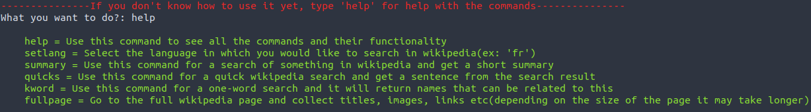

## Wikipedia quicksearch with api and python

### Various wikipedia functions using the wikipedia api and python

---

## Requirements
* Wikipedia API
* Python 3.8 or newer

---

## Functions
* Search and summarize something on wikipedia
* Quick search
* Keyword search
* Search in different wikipedia languages
* Look for specific elements on a page

---

Made by [André V.](https://github.com/Dedsd)